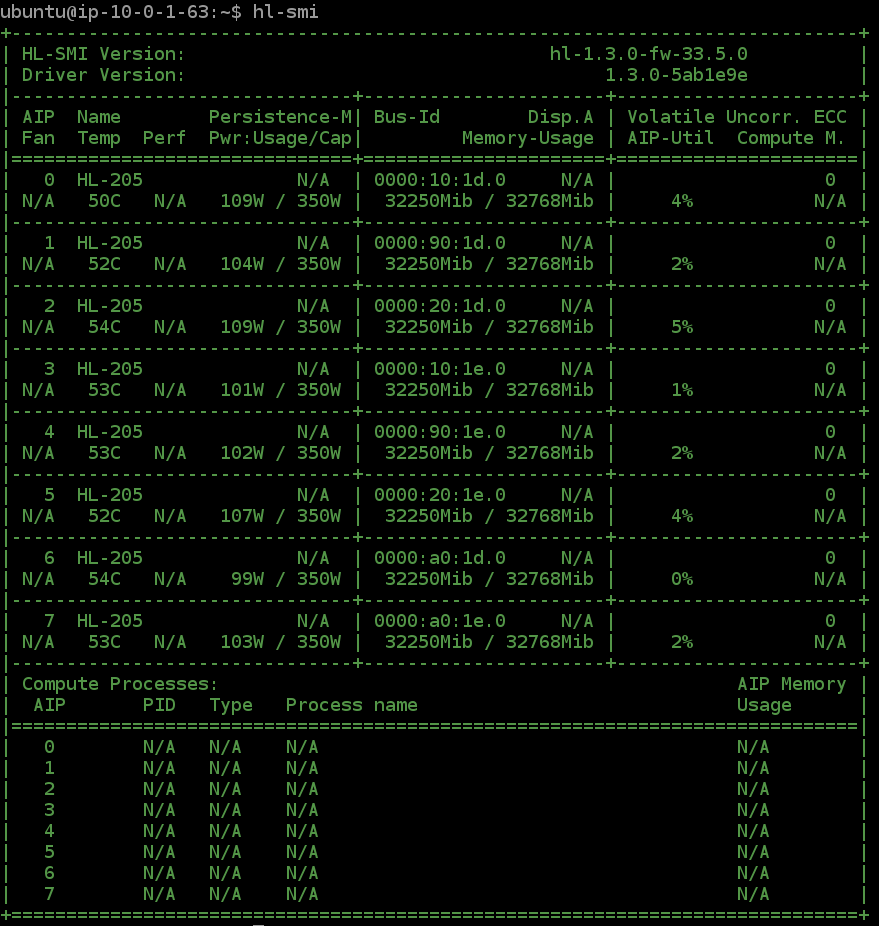

## Inspiration

I wanted to try a different approach for this hackathon. Rather than find some large available dataset, build a model and train it using the [dl1.24xlarge](https://aws.amazon.com/ec2/instance-types/dl1/) instances to come
to the unsurprising conclusion that "Yep, the new Gaudi HPUs are fast", I wanted to address an issue that I noticed with the documentation: The extreme use of [ClickOps](https://www.lastweekinaws.com/blog/clickops/), which
I believe was a bit of a contribution in people having issues on the [slack page](https://join.slack.com/t/awsdeeplearni-ftf6449/shared_invite/zt-x7w4eguu-JQM6WOL_~wnLbRc4kmbxDw).

Based on this, the challenge that I'd set myself was to try to completely cloudformation the training process of the [model references](https://github.com/HabanaAI/Model-References)
in the hope that someone else can use that work as a base for their own training, avoiding them having to solve some of the same problems that I found during the process.

## What it does
This creates a cloudformation task to train one of the example model references (specifically the [Unet](https://github.com/HabanaAI/Model-References/tree/master/PyTorch/computer_vision/segmentation/Unet)),
on ___DATA

using multiple Gaudi HPUs.




# Dataset used
The [Medical Segmentation Decathlon dataset](https://registry.opendata.aws/msd/) hosted on AWS OpenData.


## How we built it
Cloudformation


## Challenges we ran into
### Cloudformation Support
Because these instances are so new, I found a few gaps in cloudformation support that made it impossible to try some approaches which is why I ultimately settled on using an EC2 instance:
* There is currently no sagemaker support for the new dl1.24xlarge instances
* There is currently no way to enable the correct runtime via ECS in CloudFormation.

### Space
I found I had to do some workarounds (Mostly symlinking directories to the much larger /dev/hdm mount) because the 
root directory only had 8GB of space.
```zsh
OUTPUT OF CMD
```

## Accomplishments that we're proud of
I haven't really done a huge amount of cloudformation

## What we learned

## What's next for Untitled
