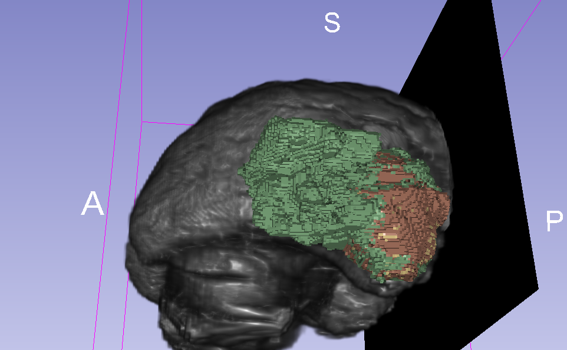
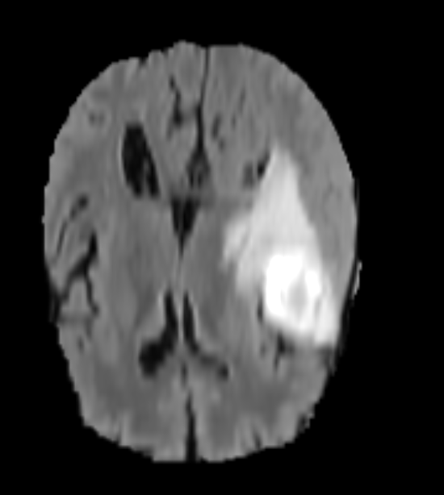

## Inspiration

I wanted to try a different approach for this hackathon. Rather than find some large available dataset, build a model and train it using the [dl1.24xlarge](https://aws.amazon.com/ec2/instance-types/dl1/) instances to come
to the unsurprising conclusion that "Yep, the new Gaudi HPUs are fast", I wanted to address an issue that I noticed with the documentation: The extreme use of [ClickOps](https://www.lastweekinaws.com/blog/clickops/), which
I believe was a bit of a contribution in myself and other peoples having issues on the [slack page](https://join.slack.com/t/awsdeeplearni-ftf6449/shared_invite/zt-x7w4eguu-JQM6WOL_~wnLbRc4kmbxDw)
since the documentation leaves you just enough room to make mistakes if you're not experienced with AWS.

Based on these difficulties I faced, I decided to set my self a challenge of setting up a cloudformation template of the training process of one of the [reference models](https://github.com/HabanaAI/Model-References), in
the hopes that people can build upon a working cloudformation template for their own training, avoiding them having to same the same problems that I found during the process.

## What it does
This cloudformation template sets up all the resources required to train the [Pytorch Unet](https://github.com/HabanaAI/Model-References/tree/master/PyTorch/computer_vision/segmentation/Unet)
and executes a script which trains the model using the Brain Tumor dataset from the [Medical Segmentation Decathlon](https://registry.opendata.aws/msd/).

As this script is running as [UserData](https://docs.aws.amazon.com/AWSEC2/latest/UserGuide/user-data.html) progress can be monitored with
```zsh
tail -f /var/log/cloud-init-output.log
```


This training script uses all 8 Gaudi HPUs


## How to use
### WARNING: These instances are expensive! Make sure to delete them after you are done!
To use this, install the [AWS CLI](https://docs.aws.amazon.com/cli/latest/userguide/getting-started-install.html),
switch your aws region to `aws-east-1` or `aws-west-2` and run
```zsh
aws cloudformation create-stack \
--template-body file://cloudformation/ec2.yml \
--stack-name aws-ml-hack \
--capabilities CAPABILITY_NAMED_IAM
```

Monitor the stack creation process in the [cloudformation](https://console.aws.amazon.com/cloudformation/home?region=us-east-1#) page or
monitor the progress in the AWS CLI with
```zsh
COMMAND
```

Once complete visit the [EC2 instances](https://console.aws.amazon.com/ec2/v2/home?region=us-east-1) page and use 
Instance Connect to SSH into your instance. In the event that this fails, try again in a few minutes because the instance 
will show as online before you can access it.

Once there you can view progress of the installation/training process with `tail -f /var/log/cloud-init-output.log`
The trained model and logs can then be found in ```/dev/shm/Model-References/PyTorch/computer_vision/segmentation/Unet/output_results```

You can then upload these to the S3 bucket that was generated with your cloudformation template since the EC2 instance
has an IamInstanceProfile that allows this. To keep things neat, this bucket will be deleted when the stack is.
# Dataset used
This uses the [Medical Segmentation Decathlon dataset](https://registry.opendata.aws/msd/) hosted on AWS OpenData. The 
dataset is best described in the [A large annotaed medical image dataset for the development and evaluation of segmentation algorithms](https://arxiv.org/pdf/1902.09063.pdf) paper.

Specifically though, this training set uses the Task01_BrainTumour dataset which is a set of 750 labelled MRI images from
patients diagnosed with glioblastoma or lower-grade glioma.


This image was created by loading the `BRATS_001.nii` data into [3D Slicer](https://download.slicer.org/).

To speed up training time, I'm running it in 2D mode, which takes each slice independently rather than trying to predict voxel space.


Unlabelled Image


Labeled Image

## How we built it
Cloudformation and a LOT of destroying the cloudformation stack and recreating it.

## Challenges we ran into
### Cloudformation Support
Because the dl1.24xlarge instaces are so new, there is limited cloudformation support. This lack of cloudformation 
has limited me to only trying to get this working via EC2 as the blockers for other services are:
* There is currently no sagemaker support for the new dl1.24xlarge instances
* There is currently no way to enable the correct runtime via ECS in CloudFormation.
### Disk Mounts
Trying to change the root volume in cloudformation when you want to only use UserData is annoying, and the root volume in
the AMI I was using only had `8GB` of storage space.

```zsh
ubuntu@ip-10-0-1-63:~$ df -h
Filesystem      Size  Used Avail Use% Mounted on
/dev/root       7.7G  3.2G  4.5G  42% /
devtmpfs        374G     0  374G   0% /dev
tmpfs           374G  444M  374G   1% /dev/shm
tmpfs            75G  1.4M   75G   1% /run
tmpfs           5.0M     0  5.0M   0% /run/lock
tmpfs           374G     0  374G   0% /sys/fs/cgroup
/dev/loop0       25M   25M     0 100% /snap/amazon-ssm-agent/4046
/dev/loop2       62M   62M     0 100% /snap/core20/1328
/dev/loop1       56M   56M     0 100% /snap/core18/2284
/dev/loop3       68M   68M     0 100% /snap/lxd/21835
/dev/loop4       44M   44M     0 100% /snap/snapd/14549
/dev/loop5       62M   62M     0 100% /snap/core20/1361
/dev/loop6       44M   44M     0 100% /snap/snapd/14978
/dev/loop7       27M   27M     0 100% /snap/amazon-ssm-agent/5163
/dev/loop8       68M   68M     0 100% /snap/lxd/22526
tmpfs            75G     0   75G   0% /run/user/1000
```

The main workarounds that I did to bypass this is:
* Pip defaults to `/tmp/` for temp files, which when downloading things like pytorch fills up fast. The solution to 
this was to use the `TMPDIR` environment variable to set pips tmp location to somewhere with more space (`/dev/sdm`).
* The pip cache at `$HOME/.lib` and the python `site-packages` at `$HOME/.lib` can get a bit big, I symlinked them to
another folder mounted in `/dev/sdm`.
* To make sure I don't get any more problems, I just symlinked `openmpi` and `habanalabs` directories since they were large.


## Accomplishments that we're proud of / What we learned
* I was pretty happy that I'd managed to get this working, I haven't done a huge amount of cloudformation before.
* I've never cloudformationed an EC2 instance before, and I became really glad I did when I kept destroying the instance 
when I started continuously destroying and recreating instances to try to debug issues and check that my fixes worked.
* I learnt a bit about where pip actually stores its files and the files it stores, because I'd never thought about that.

## What's next for Untitled
Wait for additional cloudformation support so I can create a proper sagemaker pipeline.